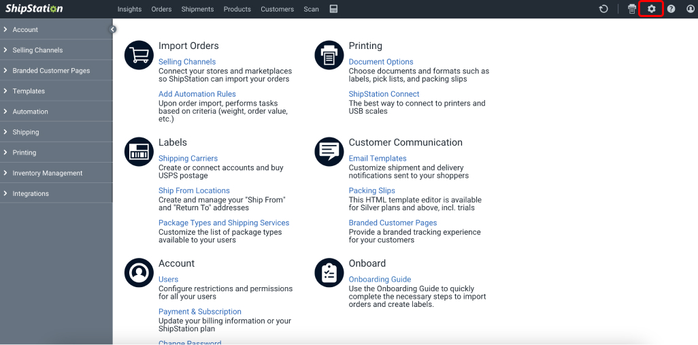

# ShipStation

This page contains the setup guide and reference information for ShipStation.

## Prerequisites

* ShipStation API Key
* API Secret

## Features

| Feature | Supported? |
| --- | --- |
| Full Refresh Sync | Yes |
| Incremental Sync | Yes |
| SSL connection | Yes |
| Namespaces | No |

## Setup guide

### Step 1: Obtain ShipStation setup details

1. Login to your ShipStation account.

2. Click the settings icon on the top right corner.

3. In the left side menu, click **Account** and then click **API Settings**.

4. Copy your **API Key** and **Secret Key**.

> If you haven't generated API keys yet, click the **Generate API Keys** button to generate your API keys. You might need to [contact ShipStation support](mailto:support@shipstation.com) to activate this function.

5. You're ready to set up ShipStation in Daspire!

### Step 2: Set up ShipStation in Daspire

1. Select **ShipStation** from the Source list.

2. Enter a **Source Name**.

3. Enter your ShipStation **API Key**.

4. Enter your ShipStation **Secret Key**.

5. Enter your ShipStation **Store ID** if you want to obtain data from a specific store.

  > Please refer to the [ShipStation doc](https://help.shipstation.com/hc/en-us/articles/4405467007771-How-do-I-access-my-Store-ID-in-ShipStation-) on how to access your Store ID in ShipStation.

6. Click **Save & Test**.

## Supported streams

This source is capable of syncing the following streams:

* [List Carriers](https://www.shipstation.com/docs/api/carriers/list/)
* [List Customers](https://www.shipstation.com/docs/api/customers/list/)
* [List Fulfillments](https://www.shipstation.com/docs/api/fulfillments/list-fulfillments/)
* [List Products](https://www.shipstation.com/docs/api/products/list/)
* [List Shipments](https://www.shipstation.com/docs/api/shipments/list/)
* [Get Store](https://www.shipstation.com/docs/api/stores/get-store/)
* [List Marketplaces](https://www.shipstation.com/docs/api/stores/list-marketplaces/)
* [List Stores](https://www.shipstation.com/docs/api/stores/list/)
* [List Users](https://www.shipstation.com/docs/api/users/list/)
* [Get Warehouse](https://www.shipstation.com/docs/api/warehouses/get/)
* [List Warehouses](https://www.shipstation.com/docs/api/warehouses/list/)
* [Get Order](https://www.shipstation.com/docs/api/orders/get-order/)

## Troubleshooting

Max number of tables that can be synced at a time is 6,000. We advise you to adjust your settings if it fails to fetch schema due to max number of tables reached.
